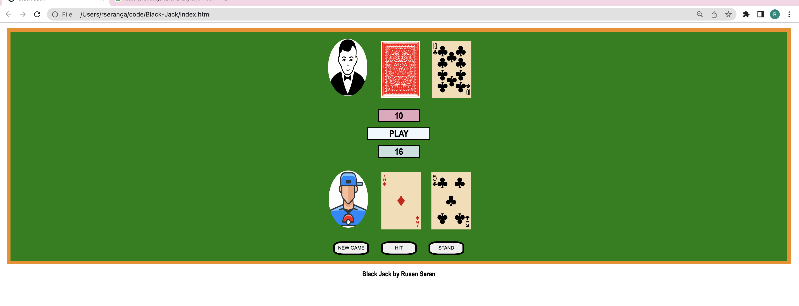

 #BlackJack by Rusen Seran

 https://russeran.github.io/BlackJack/
## 1-Rules;
1.1 -The game includes unlimited decks of cards
1.2 -Player starts the game with 2 random cards
1.3 -Dealer gets 2 random cards as well but Player able to see only one card till decide to click STAND button.
1.4 -Each card has their number's value, face cards(K,Q,J) equal to 10points and Player or Delaer can decide to use an A as 1point or 10points.
1.4 -Player aims to get more points then dealer but if sum of the player's points pass 21, Player loses the game regardless of Delaer's total points.
1.5 -If Player's sum is less than 21 points and decides to STAY. Dealer has to get a new card if Dealer's sum is less than 17 points.
1.6 -If Player's sum is less than 21 points and Dealer's sum is more than 21 Player wins.
1.7 -If Delaer and Player have less than 21 points, winner is who has more points
1.8 -If Dealer and Player have same sum, there is no winner(TIE)

##PLAY -> https://russeran.github.io/BlackJack/
## 2 -Wireframe;

## 3 -Pseudocode and Used Technologies;

<<<<<<< HEAD
-consts= 
CARDS array
 DEALER STOPS = 17, 
  MAX =21

-app states variables= 

BUTTONS
psum and dsum

-cached elements = 

gameStatus, dealerSum, playerSum, delalerCards, playerCards, PlayerAceCount, DealerAceCount
=======
used HTML, CSS and Javascript to create this game

Psuedocode

-consts= CARDS[], DEALER STOPS = 17, PLAYER MAX =21
>>>>>>> main

-app states variables= 

dealButton
hitButton
hiddenCard
playerIcon

-cached elements = 

gameStatus, 
dealerSum
playerSum
dealerAceCount
playerAceCount

-event listener = 

gameButons

-functions = 

<<<<<<< HEAD
handleClick() - for New Game, Deal, Hit and Stand butons
getNewCard()  - picking a random card from card array
newCardForPlayer() -gets a new card for player by using getNewCard()
newCardForDealer() -gets a new card for dealer by using getNewCard()
checkWin() - helps to check the winner and update the game status
checkAceForPlayer() - checks if playerSum is over 21 -> reduce A's value to 1
checkAceForDealer() -checks if dealerSum is over 17 -> reduce A's value to 1
## 4 -Helpful links & Used Technologies;

Javascript, Html and CSS used to create this game
=======
// handleClick()
// getNewCard()
// checkWin()
// newCardForPlayer()
// newCardForDealer()
// endGameReactions()
// checkAceForPlayer()
// checkAceForDealer()

## 4 - Future Enhancements

multiplayer option and chips
## 5 - Helpful links;
>>>>>>> main

4.1 -How to Play (and Win) at Blackjack: The Expert's Guide
https://www.youtube.com/watch?v=PljDuynF-j0&t=880s

<<<<<<< HEAD
## 5- Next Steps;
Multiplayer option
and adding bets for each player
=======
>>>>>>> main
