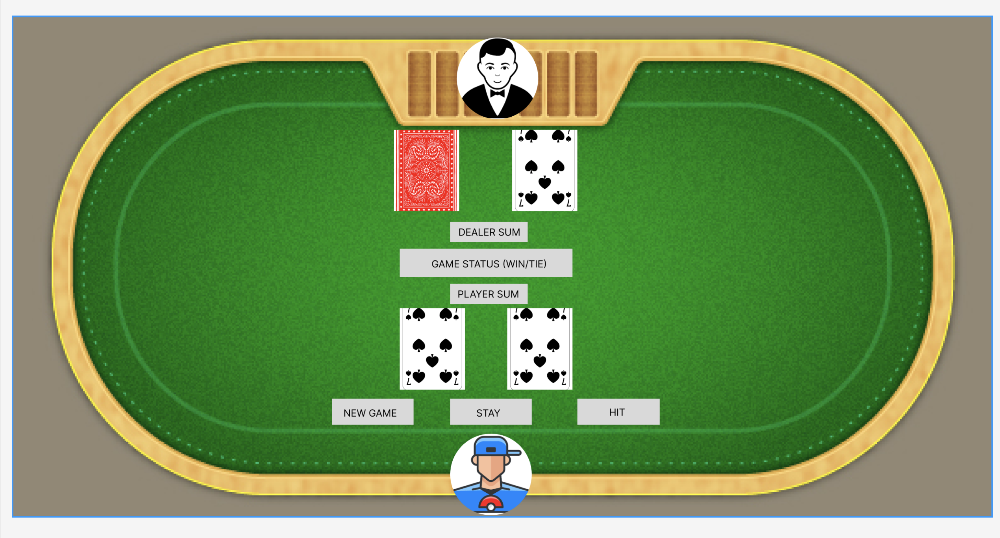

# BlackJack
## 1-Rules;
1.1 -The game includes only a deck of cards(52 cards)
1.2 -Player starts the game with 2 random cards
1.3 -Delaer gets 2 random cards as well but Player able to see only one card till decide to click STAY button.
1.4 -Each card has their number's value, face cards(K,Q,J) equal to 10points and Player or Delaer can decide to use an A as 1point or 10points.
1.4 -Player aims to get more points then dealer but if sum of the player's points pass 21, Player loses the game regardless of Delaer's total points.
1.5 -If Player's sum is less than 21 points and decides to STAY. Dealer has to get a new card if Dealer's sum is less than 17 points.
1.6 -If Player's sum is less than 21 points and Dealer's sum is more than 21 Player wins.
1.7 -If Delaer and Player have less than 21 points, winner is who has more points
1.8 -If Dealer and Player have same sum, there is no winner(TIE)

## 2 -Wireframe;

## 3 -Pseudocode;

pseudocode of how the game would work in JavaScript
h

consts CARDS, DEALER STOPS = 17, PLAYER MAX =21

## 4 -Helpful links;

4.1 -How to Play (and Win) at Blackjack: The Expert's Guide
https://www.youtube.com/watch?v=PljDuynF-j0&t=880s

https://www.markdownguide.org/basic-syntax/##
